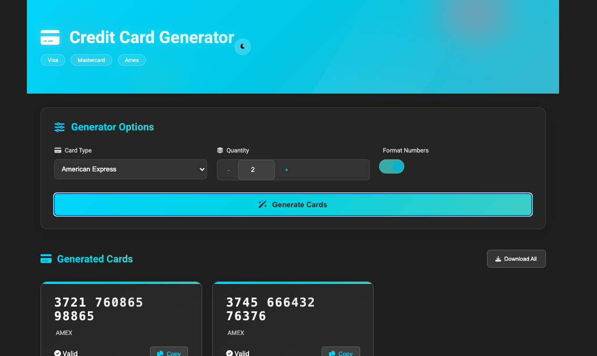

# Credit Card Generator

A sophisticated web application that generates valid credit card numbers for testing and educational purposes. Built with modern web technologies and featuring an elegant, responsive design with dark/light theme support.



## 🚀 Features

- **Card Generation**

  - Support for Visa, Mastercard, and American Express
  - Luhn algorithm implementation for valid numbers
  - Batch generation (up to 10 cards)
  - Configurable number formatting

- **Modern UI/UX**

  - Responsive glass-morphism design
  - Dark/Light theme support
  - Smooth animations and transitions
  - Copy to clipboard functionality
  - Batch download as text file

- **Educational Component**
  - Interactive Luhn algorithm explanation
  - Built-in validation checking
  - Educational disclaimer

## 🛠️ Technologies

- HTML5
- CSS3 (Custom Properties, Flexbox, Grid)
- Vanilla JavaScript (ES6+)
- Font Awesome Icons
- Google Fonts (Roboto)

## 🔧 Installation

1. Clone the repository:

   ```bash
   git clone https://github.com/yourusername/credit-card-generator.git
   ```

2. Navigate to the project directory:

   ```bash
   cd credit-card-generator
   ```

3. Open `index.html` in your browser:
   ```bash
   open index.html  # macOS
   xdg-open index.html  # Linux
   start index.html  # Windows
   ```

## 💻 Usage

1. **Select Card Type**

   - Choose between Visa, Mastercard, or American Express

2. **Configure Options**

   - Set quantity (1-10 cards)
   - Toggle number formatting
   - Adjust any additional settings

3. **Generate Cards**

   - Click "Generate Cards" button
   - Copy individual numbers or download all

4. **Additional Features**
   - Toggle dark/light theme
   - Learn about the Luhn algorithm
   - View validation status

## 🎨 Customization

### Adding New Card Types

Add new card types in `script.js`:

```javascript
cardTypes.newType = {
  prefix: "123", // or ["123", "124"] for multiple
  length: 16,
};
```

### Modifying Theme Colors

Adjust colors in `styles.css`:

```css
:root {
  --primary: #your-color;
  --accent-1: #your-color;
  /* ...other colors */
}
```

## 📝 Technical Details

### Luhn Algorithm Implementation

The application uses the Luhn algorithm to generate valid credit card numbers:

1. Generate base number with correct prefix
2. Calculate check digit using Luhn formula
3. Validate final number

### Performance Considerations

- Client-side generation
- Optimized DOM manipulation
- Efficient event handling
- Responsive design best practices

## 🔒 Security Notes

- All processing happens client-side
- No real card data is used or stored
- Generated numbers are for testing only
- Includes clear educational disclaimer

## 🤝 Contributing

1. Fork the repository
2. Create your feature branch (`git checkout -b feature/amazing-feature`)
3. Commit your changes (`git commit -m 'Add amazing feature'`)
4. Push to the branch (`git push origin feature/amazing-feature`)
5. Open a Pull Request

## ⚠️ Disclaimer

This tool is for educational and testing purposes only. Generated numbers should not be used for real transactions or fraudulent purposes.

## 👏 Credits

Created with 👨🏾‍💻 by [Your Ocdeed Codes]
Icons by [Font Awesome](https://fontawesome.com)
Fonts by [Google Fonts](https://fonts.google.com)
